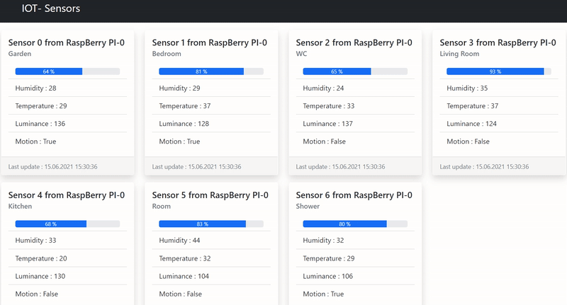

# iot-sensor 
Show some sensor datas

## [./bin/www](./bin/www)
Express + WebSocker server  
`npm start`

## [scraper](./scraper.py)
Scrape datas and send it to a websocket server  
`python scraper.py`

next ... scrapper.py on leave
next ... design bootstrap 4 to 5
